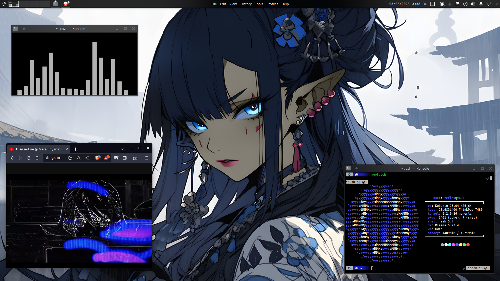

# .dotfiles

A remote backup repository containing my KDE Plasma `~/.dotfiles`, along with a script to spin up my development environment in any machine.

# Table of Contents

- [Installation](https://github.com/Luzefiru/.dotfiles/tree/main#installation)
- [Themes](https://github.com/Luzefiru/.dotfiles/tree/main#themes)
- [Keybinds](https://github.com/Luzefiru/.dotfiles/tree/main#keybinds)
  - [Essential Shortcuts](https://github.com/Luzefiru/.dotfiles#essential-shortcuts)
  - [Tiling & Workspaces](https://github.com/Luzefiru/.dotfiles#tiling--workspaces)
- [Troubleshooting](https://github.com/Luzefiru/.dotfiles/tree/main#troubleshooting)
- [TODO](https://github.com/Luzefiru/.dotfiles/tree/main#todo)
- [Resources](https://github.com/Luzefiru/.dotfiles/tree/main#resources)

# Installation

Running the `install.sh` script will install multiple apt packages for my development workflow. Afterwards, it will download a [Konsave](https://github.com/Prayag2/konsave) profile with all my configuration files, fonts, and KDE Plasma settings.

```bash
$ cd ~
$ curl -O https://raw.githubusercontent.com/Luzefiru/.dotfiles/main/.github/install.sh
$ sudo chmod u+x ./install.sh
$ ~/install.sh        # core installation & downloads
$ reboot              # to enable configs
$ rm index.sh setup-dotfiles.sh post-install.sh
```

# Themes

<figure>
  
  <figcaption><code>dev</code> Konsave Profile, ChromeOS Global Theme with Breeze AlphaBlack Plasma Window Decorations.</figcaption>
</figure>

# Keybinds

These are the `Settings > Keyboard Shortcuts` I use, heavily inspired by `bspwm` + `sxhkd` workflows.

### Essential Shortcuts

| Key                                  | Function                                  |
| ------------------------------------ | ----------------------------------------- |
| <kbd>Meta</kbd> + <kbd>Space</kbd>   | Launches Krunner.                         |
| <kbd>Meta</kbd> + <kbd>Q</kbd>       | Closes a window.                          |
| <kbd>Meta</kbd> + <kbd>W</kbd>       | Launches Brave Browser.                   |
| <kbd>Meta</kbd> + <kbd>E</kbd>       | Launches Dolphin.                         |
| <kbd>Prt Sc</kbd>                    | Screenshots & launches Spectacle.         |
| <kbd>Shift</kbd> + <kbd>Prt Sc</kbd> | Screenshots the entire screen.            |
| <kbd>Super</kbd> + <kbd>Prt Sc</kbd> | Screenshots the currently focused window. |

### Tiling & Workspaces

| Key                                 | Function                                           |
| ----------------------------------- | -------------------------------------------------- |
| <kbd>Meta</kbd> + <kbd>→</kbd>      | Tiles a window to the right.                       |
| <kbd>Meta</kbd> + <kbd>←</kbd>      | Tiles a window to the left.                        |
| <kbd>Meta</kbd> + <kbd>&rsqb;</kbd> | Switches to the next virtual desktop on the right. |
| <kbd>Meta</kbd> + <kbd>&lsqb;</kbd> | Switches to the next virtual desktop on the left.  |

# Troubleshooting

- Where are my old configuration files?

  > Anything that ins't a KDE configuration file should be stored in a `~/.dotfiles-backup/` directory.

- What happened to my old KDE Plasma configuration?

  > Konsave overwrites the old profile, so it is most likely lost. Please back up your profile via Konsave if you plan to use my profiles as a standalone theme.

- How do I use Konsave in my terminal?

  > Run `source ~/.venv/bin/activate` first and then you can run `konsave -h` to check if it works. You have to do this every time you intend to use the `konsave` command.

- Will this work on other KDE Plasma Linux Distros?

  > I haven't personally tested them, so please create a pull request to change this answer if ever you successfully run my script using another distro.

- I accidentally terminated the script mid-installation. Can I rerun it?

  > Yes, but I haven't experimented with that behavior outside of fresh installations.

- Can I add my own selection of packages?

  > Of course. You can easily add them via the `.github/scripts/index.sh` file inside the Bash lists. I recommend forking your code and experimenting with the script yourself!

# TODO

- [ ] Create script to just download the Konsave profile & apply the theme after backing the old one up.
- [ ] Split install script into knowledge domains and make it more modular for selecting packages & themes.

# Resources

- [Dotfiles: Best Way to Store in a Bare Git Repository](https://www.atlassian.com/git/tutorials/dotfiles)
- [Konsave (Save Linux Customization)](https://github.com/Prayag2/konsave)
